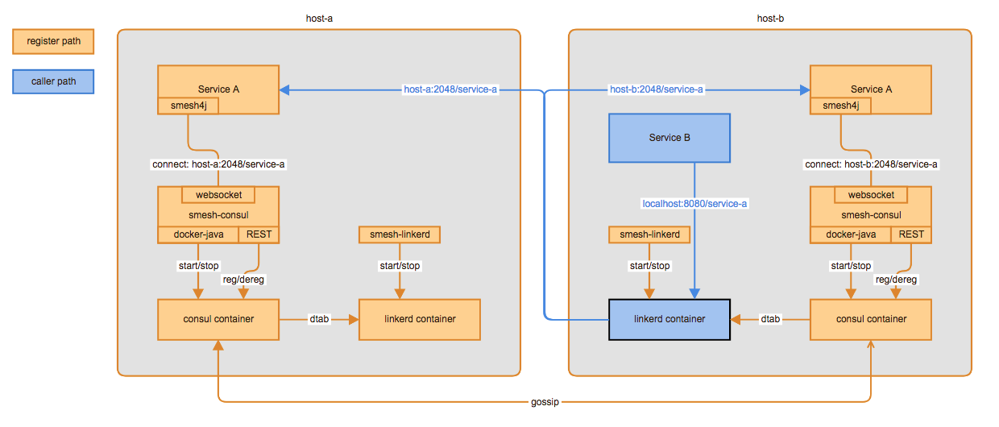

# Smesh

a service mesh implementation using linkerd and consul

## Overview

## Linkerd

used a java process (smesh-linkerd) to manage linkerd docker container start/stop.

## Consul

used a java process (smesh-consul) to manage consul docker container start/stop and cluster construction

### Start / Stop

a new consul container will be created and started together with the daemon process startup.
when the daemon being shutdown gracefully, a shutdown hook will be triggered to tell the consul container to leave the cluster before shutdown.

#### start smesh-consul only
if a running consul container already exists and it's created by the current smesh-consul version, it will attach the running container's log without recreating a new one

## Clustering

#### On EC2 environment
requires tags / values on your instances

    consul.role=<server | client>
    consul.nodeName=<unique node name>

#### On non EC2 environment
requires VM options:

    -Dconsul.role=<server | client>
    -Dconsul.cluster.member=<server list>

or environment variables:

    export consul.role=<server | client>
    export consul.cluster.member=<server list>

### Build

tests annotated with @IntegrationTest requires docker to be installed

tests with @IntegrationTest are ignored by default if run by:

    mvn clean test

to run all tests including @IntegrationTest

    mvn clean test -PtestAll

### Benchmark

[Benchmark test](smesh-tests/src/test/java/com/github/lkq/smesh/test/benchmark/BenchmarkTest.java)

- smesh

    {"total": 3269, "count": 100, "avg": 32}

- direct access

    {"total": 1002, "count": 100, "avg": 10}