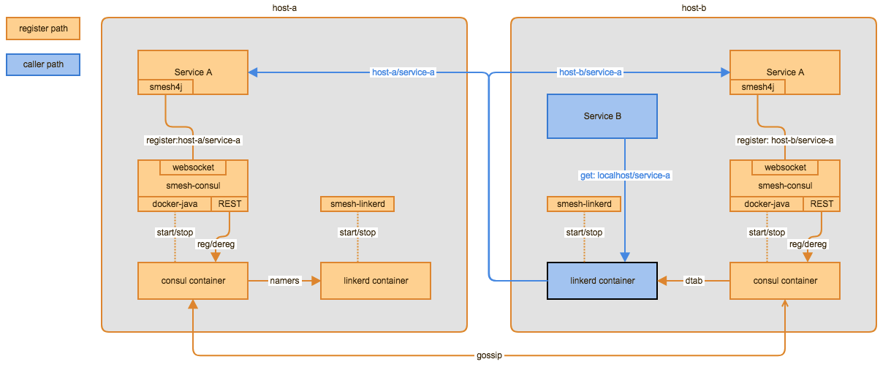

# Smesh

a service mesh implementation using linkerd and consul

## Overview

smesh consisted of:
- the linkerd docker container and smesh-linkerd - a process to manage the linkerd container
- consul docker container and smesh-consul - a process to manage the consul container cluster
- smesh4j - a client lib for registering REST service to smesh

consul clustering

- EC2: tags your VM running consul

        consul.role=<server | client>
        consul.nodeName=<unique node name>

- linux host: provide VM options, or environment variables

        -Dconsul.role=<server | client>
        -Dconsul.cluster.member=<server list>

        export consul.role=<server | client>
        export consul.cluster.member=<server list>

### Build & Test

    mvn clean test

to run integration tests

    mvn clean test -PtestAll

### Benchmark

a simple benchmark test
[Benchmark test](smesh-tests/src/test/java/com/github/lkq/smesh/test/benchmark/BenchmarkTest.java)

1k request results on Mac Core i5 2.4 GHz with 10G Memory
- smesh
    {"total": 12667243786 ns, "count": 1000, "avg": 12667243 ns}
- direct access
    {"total": 1331499682 ns, "count": 1000, "avg": 1331499 ns}
